### THIS IS PROTOTYPE ONLY ###
<div align="center">

# 🏥 MediConsult — Enterprise Telemedicine Platform

**Production-grade medical consultation infrastructure built for scale, security, and compliance**

[](https://nextjs.org/)
[](https://www.typescriptlang.org/)
[](https://www.postgresql.org/)
[](https://redis.io/)
[](https://www.prisma.io/)
[](https://bullmq.io/)
[](https://github.com/Shopify/toxiproxy)
[](LICENSE)

> A full-stack telemedicine backend solving hard distributed systems problems: race-condition-free scheduling, stateless real-time pub/sub, transactional outbox delivery, HIPAA-aligned audit enforcement, and chaos-engineering-proven resilience — built to hospital-grade reliability standards.

</div>

---

## 👔 Executive Summary

**What is this?**
MediConsult is a production-ready telemedicine engine — the kind that powers platforms like Teladoc or Practo. It manages the complete patient journey: booking → payment → live consultation with a verified doctor → digital prescription.

**Why is this genuinely hard to build?**

> Imagine a hospital system that processes payments, assigns doctors, and runs live consultations simultaneously across thousands of users. Now imagine what happens when two doctors click "Accept Patient" at the exact same millisecond. Or when the server crashes exactly while a prescription is being sent. Or when the payment gateway sends the same webhook twice.

Every one of these scenarios causes catastrophic data corruption in naïve systems. MediConsult was engineered from the ground up to make all of them *structurally impossible*:

- **Double-booking** is eliminated at the database level using atomic Compare-And-Swap — no application locks needed
- **Lost messages** are impossible using the Transactional Outbox Pattern — events are committed to PostgreSQL atomically with the action that triggered them
- **Duplicate payments** are blocked via database-level idempotency keys on every financial operation
- **System crashes** are survived gracefully — workers recover jobs, outbox events replay, and WebSocket clients reconnect without losing state

The entire system was put through **Chaos Engineering** — using Toxiproxy to deliberately sever database connections, crash worker processes, and corrupt network traffic mid-operation — and proved it recovers completely every time.

---

## 📑 Table of Contents

1. [Executive Summary](#-executive-summary)
2. [Platform Overview](#-platform-overview)
3. [System Architecture](#-system-architecture)
4. [User Roles & Access Control](#-user-roles--access-control)
5. [Consultation Lifecycle & State Machine](#-consultation-lifecycle--state-machine)
6. [End-to-End Workflow](#-end-to-end-workflow)
7. [Real-Time Gateway & Pub/Sub](#-real-time-gateway--pubsub)
8. [Background Worker Architecture](#-background-worker-architecture)
9. [Security Model](#-security-model)
10. [Observability & Metrics](#-observability--metrics)
11. [Database Schema](#-database-schema)
12. [API Reference](#-api-reference)
13. [Tech Stack](#-tech-stack)
14. [Project Structure](#-project-structure)
15. [Key Engineering Decisions](#-key-engineering-decisions)
16. [System Invariants](#-system-invariants)
17. [Testing & Chaos Engineering](#-testing--chaos-engineering)
18. [Quick Start](#-quick-start)
19. [Deployment](#-deployment)

---

## 🌟 Platform Overview

| Capability | Implementation |
|---|---|
| 🔐 **Zero-Trust Security** | HTTP-only sessions, CSRF double-submit cookie+header, per-route RBAC guards |
| ⚛️ **Atomic State Machine** | Consultation transitions via SQL CAS with version-stamped rows — no distributed locks |
| 🧾 **Immutable Audit Logs** | Prisma ORM extension blocks `update`/`delete` on `AuditLog` at the library layer |
| 💳 **Idempotent Payments** | Razorpay integration with `externalEventId UNIQUE` dedup on all webhook events |
| 🌐 **Stateless Real-Time Gateway** | Separate WebSocket server backed by Redis Pub/Sub — horizontally scalable |
| ✉️ **Transactional Outbox** | Side effects committed in same DB transaction as the triggering state change |
| 📋 **Hybrid File Storage** | `StorageProvider` interface auto-selects S3 or local disk based on env credentials |
| ⚡ **Redis Backpressure** | Per-endpoint concurrency caps via `INCR`/`DECR` with `finally` block guarantee |
| 📨 **8 Async BullMQ Workers** | Assignment, notification, refund, refund-recovery, webhook, outbox-recovery, sweeper |
| 📊 **Prometheus Observability** | Counters, histograms, gauges for every layer — HTTP, socket, Redis, queue, outbox |
| 🎭 **Chaos-Proven Resilience** | 5 test profiles, 30+ scenarios, Toxiproxy fault injection, Docker SIGKILL recovery |

---

## 🏗 System Architecture

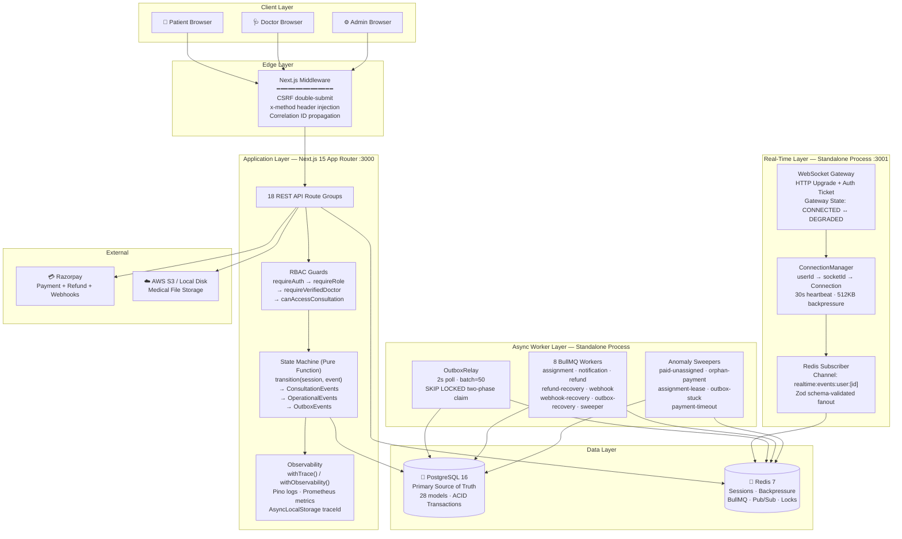

---

## 👤 User Roles & Access Control

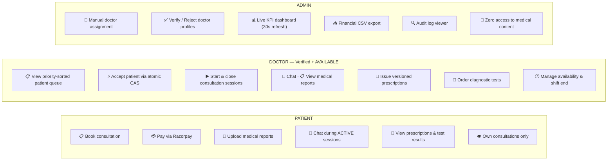

**Guard Composition Chain:**
```
requireAuth() → validates HTTP-only session (Redis cache → DB fallback)
  └─ requireRole('DOCTOR') → exact role match
       └─ requireVerifiedDoctor() → DoctorProfile.verificationStatus = 'VERIFIED'
  └─ canAccessConsultation(id) → must be the patient OR the assigned doctor
```

---

## 🔄 Consultation Lifecycle & State Machine

The consultation lifecycle is governed by a **strict, server-enforced, pure-function state machine**. Every transition is atomic at the PostgreSQL level using Compare-And-Swap. Invalid transitions throw at the pure function before ever touching the database.

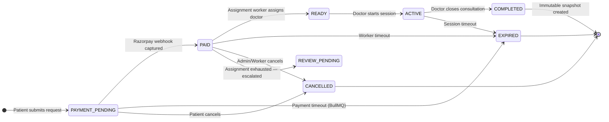

**Cancellation Authority Matrix:**
| Actor | Can Cancel |
|---|---|
| `PATIENT` | `PAYMENT_PENDING` only |
| `WORKER / SYSTEM` | `PAYMENT_PENDING`, `PAID` |
| `ADMIN` | `PAYMENT_PENDING`, `PAID`, `READY` |

**Auto-Refund Trigger:** When `PAID → EXPIRED` or `PAID → CANCELLED`, the pure state machine function automatically emits a `REFUND_REQUESTED` outbox event *within the same DB transaction* — ensuring no patient is ever charged without service.

---

## ⏱ End-to-End Workflow

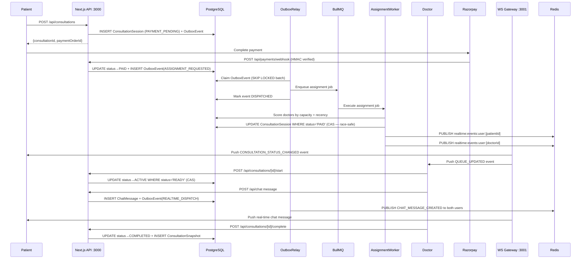

---

## 🌐 Real-Time Gateway & Pub/Sub

The platform runs a **fully stateless WebSocket server** as a separate Node.js process on port 3001, completely independent of the Next.js API layer. This enables independent horizontal scaling.

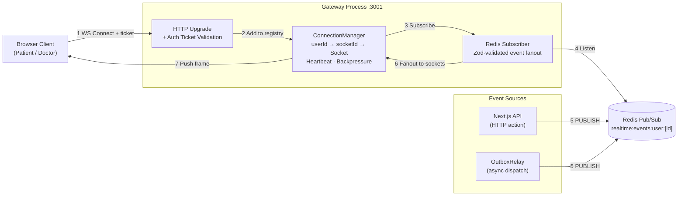

**Connection Protocol:**
1. Client calls `GET /api/auth/realtime-ticket` — receives a one-time UUID stored in Redis (TTL: 30s)
2. Client opens `ws://gateway:3001?ticket=<uuid>` — gateway redeems ticket from Redis (single-use)
3. Gateway sends `CONNECTION_ESTABLISHED` control frame. Clients **must not subscribe** until this is received — eliminates reconnect race conditions
4. Gateway broadcasts `SYSTEM_DEGRADED` if Redis goes down, transitions to `DEGRADED` state, and recovers automatically

**Real-Time Event Types** (all Zod schema-validated):

| Event | Trigger |
|---|---|
| `CONSULTATION_STATUS_CHANGED` | Any state machine transition (carries `consultationVersion`) |
| `CHAT_MESSAGE_CREATED` | New chat message persisted to DB |
| `QUEUE_UPDATED` | Queue length changes |
| `PRESCRIPTION_UPDATED` | Doctor issues or revises prescription |
| `SESSION_REVOKED` | Session invalidated server-side |

---

## ⚙️ Background Worker Architecture

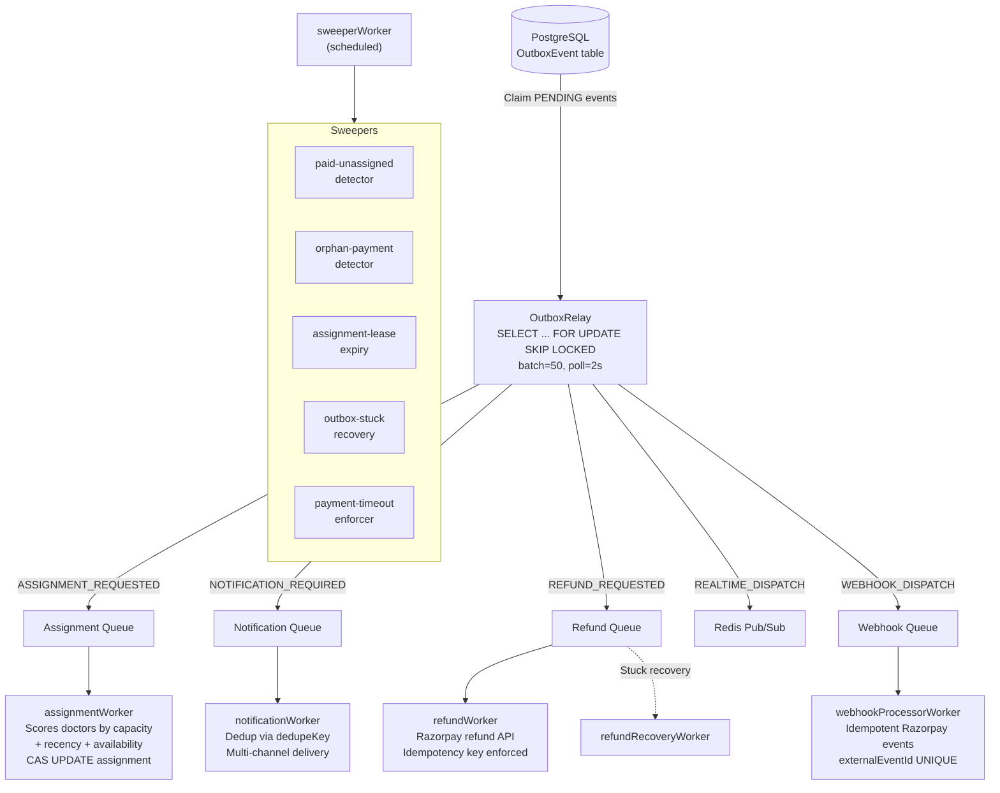

**OutboxRelay Two-Phase Claim:**
```
Phase 1 — Atomic Claim:
  SELECT id FROM OutboxEvent
  WHERE status='PENDING' AND (nextRetryAt IS NULL OR nextRetryAt <= NOW())
  LIMIT 50
  FOR UPDATE SKIP LOCKED   ← Zero deadlock multi-process safe

Phase 2 — Process & Settle:
  Mark PROCESSING → execute → mark DISPATCHED
  On failure: exponential backoff (2^n × 2s), max 5 retries → FAILED_PERMANENT
```

---

## 🔒 Security Model

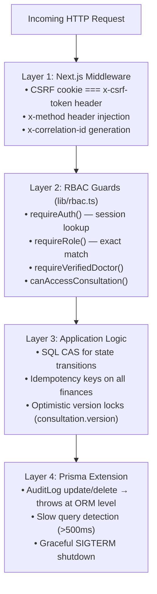

**HIPAA-Aligned Audit Logging:**
- Only `fieldNamesChanged` is logged (e.g., `["status", "startedAt"]`) — never actual medical values
- No PHI (Protected Health Information) ever touches audit tables
- `AuditLog` is structurally immutable — blocked at the ORM layer, not just policy

**Financial Idempotency:**
- `WebhookEvent.externalEventId` — `UNIQUE` constraint prevents duplicate payment processing
- `RefundRequest.idempotencyKey` — `UNIQUE` constraint prevents duplicate refunds
- `Notification.dedupeKey` — `UNIQUE(userId, dedupeKey)` prevents duplicate alerts

---

## 📡 Observability & Metrics

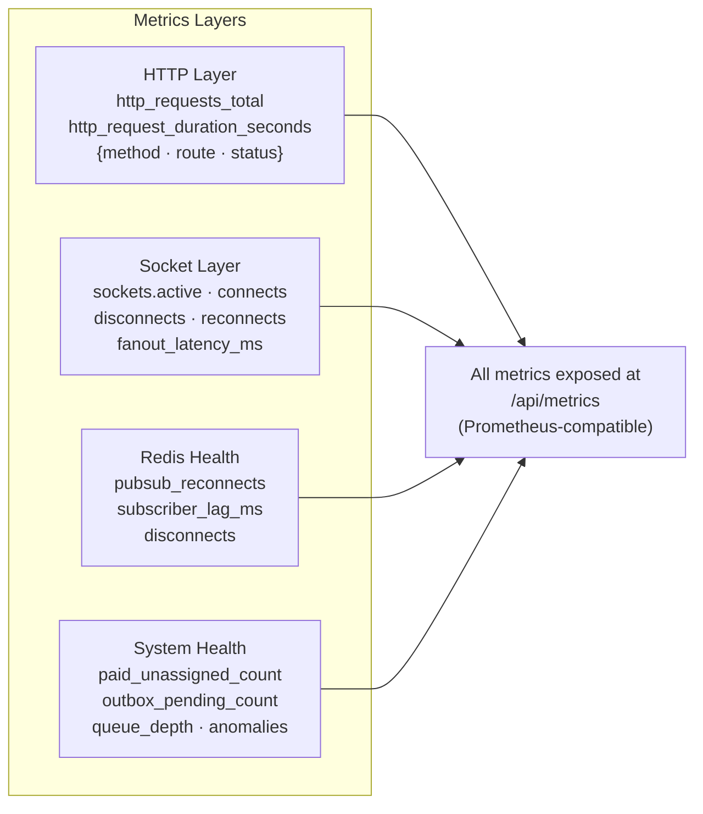

Every API request is wrapped with `withTrace()` which:
- Generates or propagates `x-correlation-id` through `AsyncLocalStorage`
- Attaches `x-trace-id` to every response for client-side debugging
- Records Prometheus request counter + duration histogram
- Triggers `sendAlert('CRITICAL', ...)` on any unhandled 500 error

All logs emitted as **structured Pino JSON** with `traceId`, `userId`, `event`, `durationMs` — ready for Loki, Datadog, or CloudWatch.

---

## 🗄 Database Schema

28 models, 18 enums — source of truth at [`prisma/schema.prisma`](prisma/schema.prisma).

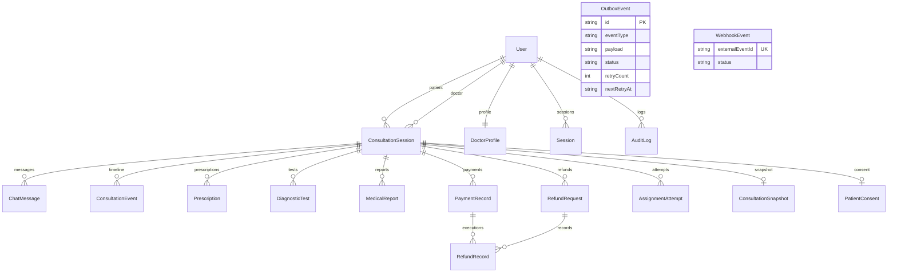

**Key Design Decisions in the Schema:**

| Pattern | Where Used |
|---|---|
| `version Int` optimistic lock | `ConsultationSession` — stale writes rejected |
| `idempotencyKey String UNIQUE` | `RefundRequest`, `RefundRecord` — no double refunds |
| `externalEventId String UNIQUE` | `WebhookEvent` — idempotent webhook dedup |
| `dedupeKey UNIQUE(userId, dedupeKey)` | `Notification` — no duplicate alerts |
| `FOR UPDATE SKIP LOCKED` | `OutboxEvent` — deadlock-free multi-process claim |
| Composite indices | `DoctorProfile(verificationStatus, acceptingNewPatients, availabilityStatus, lastSeenAt)` |

---

## 📡 API Reference

All mutations enforce CSRF at the middleware layer before route handlers run.

| Group | Endpoints | Highlights |
|---|---|---|
| **Auth** | `register · login · logout · me · realtime-ticket` | HTTP-only cookie sessions, single-use WS tickets |
| **Consultations** | `create · get · start · complete · cancel · message · prescription · tests` | CAS state transitions, idempotent retries |
| **Payments** | `create-order · webhook · mock` | HMAC-verified Razorpay webhooks, idempotent processing |
| **Reports** | `upload · download · verify` | SHA-256 hash verification, MIME validation |
| **Prescriptions** | `issue · verify/[code]` | Versioned prescriptions, public verification endpoint |
| **Doctor** | `queue · accept · heartbeat · availability` | Priority-sorted queue, atomic CAS accept |
| **Admin** | `stats · queue · assign · audit · export · verify-doctor` | KPI dashboard, CSV export, audit viewer |
| **Metrics / Health** | `/api/metrics · /api/health · /health/realtime` | Prometheus scrape, app + gateway health |

---

## 🛠 Tech Stack

| Category | Technology |
|---|---|
| **Framework** | Next.js 15.5 (App Router, Turbopack) |
| **Language** | TypeScript 5.7 (strict mode, across all layers) |
| **Database** | PostgreSQL 16 (ACID, CAS patterns, composite indices) |
| **ORM** | Prisma 6 with custom client extension (audit enforcement) |
| **Cache / Queue Bus** | Redis 7 via ioredis (sessions, rate limits, pub/sub, BullMQ) |
| **Job Queue** | BullMQ (8 named queues, exponential backoff, deduplication) |
| **WebSocket** | `ws` library (stateless gateway, heartbeat, backpressure) |
| **Schema Validation** | Zod (realtime event envelopes, API request payloads) |
| **Payments** | Razorpay SDK (payment + refund + HMAC webhook verification) |
| **File Storage** | AWS S3 SDK / Local disk (pluggable `StorageProvider`) |
| **Metrics** | prom-client (counters, histograms, gauges — low-cardinality enforced) |
| **Logging** | Pino (structured JSON, `AsyncLocalStorage` trace propagation) |
| **Testing** | Jest + ts-jest, Playwright (E2E) |
| **Chaos Testing** | Shopify Toxiproxy (network fault injection) |
| **Containerization** | Docker + Docker Compose (7-service chaos environment) |
| **CSS** | Tailwind CSS 4 |

---

## 📁 Project Structure

```
doctor-consult/
├── app/                          # Next.js App Router
│   ├── api/                      # 18 REST API route groups
│   │   ├── consultations/[id]/   # Lifecycle: start, complete, cancel, chat, prescription, tests
│   │   ├── payments/             # create-order, HMAC webhook, mock
│   │   ├── admin/                # stats, queue, assign, audit, export, verify-doctor
│   │   ├── auth/                 # register, login, logout, me, realtime-ticket
│   │   ├── doctor/               # queue, accept, heartbeat, availability
│   │   ├── reports/              # upload + authenticated download
│   │   ├── prescriptions/verify/ # Public prescription verification
│   │   ├── metrics/              # Prometheus scrape endpoint
│   │   └── health/               # App health check
│   ├── admin/                    # Admin dashboard UI
│   ├── doctor/                   # Doctor dashboard + history + profile
│   ├── patient/                  # Patient dashboard + history + profile
│   └── login/ register/ verify/  # Auth pages
│
├── realtime-gateway/             # Standalone WebSocket server :3001
│   ├── server.ts                 # HTTP upgrade · Auth · Redis Pub/Sub · DEGRADED mode
│   └── ConnectionManager.ts      # userId→socketId registry · heartbeat · 512KB backpressure
│
├── shared/realtime/
│   └── events.ts                 # Zod schemas: RealtimeEventSchema, ControlMessageSchema
│
├── worker/                       # Standalone background process
│   ├── main.ts                   # Bootstrap: queues, relay, sweepers, heartbeat
│   ├── outboxRelay.ts            # Two-phase SKIP LOCKED batch poll
│   ├── sweepers.ts               # Anomaly detection sweepers (5 sweepers)
│   ├── definitions/              # 8 BullMQ worker definitions
│   └── services/                 # heartbeat · notification providers · repeatables
│
├── lib/                          # Core server-side library
│   ├── consultation-state-machine.ts  # Pure function state machine
│   ├── rbac.ts                   # requireAuth · requireRole · canAccessConsultation
│   ├── auth.ts                   # Session: create, get (Redis-cached 30min), destroy
│   ├── prisma.ts                 # Singleton + AuditLog immutability extension
│   ├── redis-factory.ts          # Real/mock factory + placeholder-aware TLS detection
│   ├── queue.ts                  # 8 BullMQ Queue instances
│   ├── metrics.ts                # Prometheus MetricsRegistry (strict low-cardinality)
│   ├── withTrace.ts              # AsyncLocalStorage traceId + Prometheus recording
│   ├── lock.ts                   # Redis SET NX PX + Lua compare-and-delete release
│   ├── storage/                  # StorageProvider interface + S3 + Local implementations
│   └── audit.ts                  # Append-only audit log helpers
│
├── prisma/
│   ├── schema.prisma             # 28 models, 18 enums, 645 lines
│   └── seed.ts                   # Test data: patients, doctors, admins
│
├── tests/                        # 5 test profiles, 30+ scenarios
│   ├── api/                      # API integration (auth, lifecycle, payments, chat, uploads)
│   ├── reliability/              # Reconnect semantics, Postgres/Redis restart, SIGKILL recovery
│   ├── destructive/              # Chaos: CAS integrity, IDOR, race conditions, Docker crashes
│   ├── stress/                   # Throughput, concurrency, real-time chaos
│   └── contracts/                # Schema and invariant contracts
│
├── middleware.ts                  # CSRF + x-method + correlation-id (Edge)
├── toxiproxy.json                 # Toxiproxy: Redis :6379 + Postgres :5432 proxies
├── docker-compose.test.yml        # 7-service chaos environment
├── SYSTEM_INVARIANTS.md          # Non-negotiable architectural guarantees
└── AGENT_INSTRUCTIONS.md         # Instructions for AI coding agents on this repo
```

---

## 🧠 Key Engineering Decisions

### 1. SQL-Level CAS — Zero Application Locks
Every state transition uses `UPDATE ... WHERE status = 'EXPECTED' RETURNING id`. If 0 rows are updated, a concurrent actor already won. No Redis locks, no distributed coordination overhead, no failure modes from lock expiry.

### 2. `FOR UPDATE SKIP LOCKED` — Deadlock-Free Outbox
The OutboxRelay claims event batches using PostgreSQL's `SKIP LOCKED` clause. Multiple worker instances can run concurrently without ever deadlocking or processing the same event twice.

### 3. Pure-Function State Machine
`transition(session, params)` has zero side effects. It validates the transition and returns Prisma payload arrays. The caller commits everything in a single `$transaction`. This means the state machine is fully unit-testable without any infrastructure.

### 4. Backpressure in `finally` Blocks
Redis `INCR`/`DECR` concurrency counters are decremented in `finally` blocks — guaranteed execution even when `requireRole()` throws `ForbiddenError`. No permanent counter inflation from handler crashes.

### 5. ORM-Level Immutability
Prisma client extension intercepts all `update`/`delete` on `AuditLog` and throws a compliance error. This is enforced at the ORM layer — no policy document can override it at runtime.

### 6. Stateless Gateway via Redis Pub/Sub
The WebSocket gateway holds zero state about which consultations exist. It only manages socket connections. All domain events arrive from Redis. This allows the gateway to crash and restart without losing any domain state.

### 7. Versioned Events — Stale-Event Protection
`ConsultationStatusChanged` events carry `consultationVersion` (monotonic DB integer). Clients discard events with version ≤ their last-seen version, preventing stale events from corrupting UI state after reconnects.

### 8. Placeholder-Aware S3 Detection
```typescript
function isS3Configured(): boolean {
    const keyId = process.env.AWS_ACCESS_KEY_ID ?? '';
    if (!keyId || keyId.startsWith('your-')) return false;
    return true;
}
```
Prevents accidental AWS calls when `.env` contains placeholder values — a common cause of mysterious 500 errors in dev.

---

## 📜 System Invariants

These are **non-negotiable architectural guarantees** documented in `SYSTEM_INVARIANTS.md`. Every future change must prove it preserves all of them.

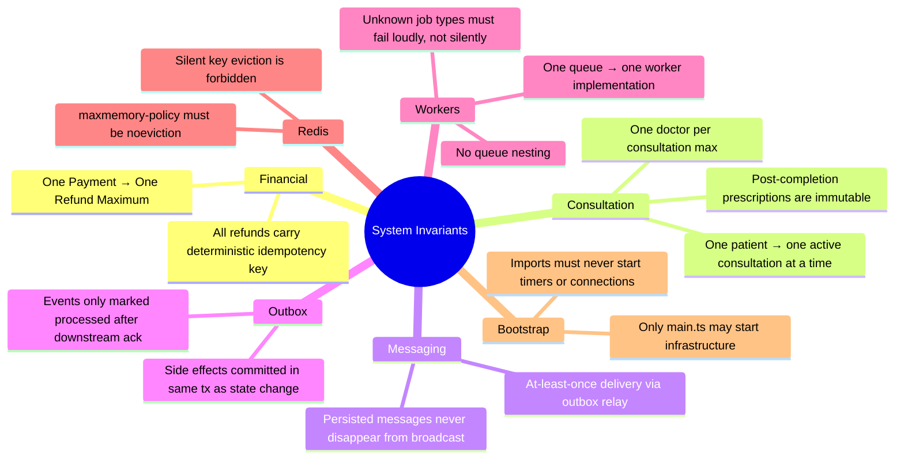

---

## 🧪 Testing & Chaos Engineering

The platform is proven through **five independent test profiles** in a fully Dockerized chaos environment.

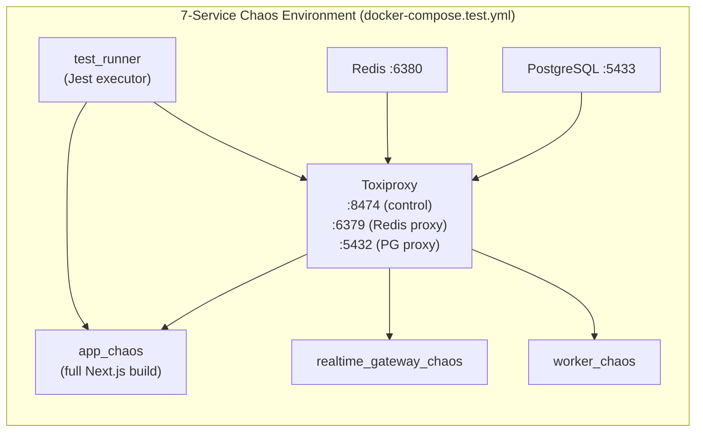

> All services connect **through Toxiproxy**, not directly to Redis or Postgres. This allows tests to inject failures with a single HTTP call to the Toxiproxy control API.

### Test Profiles

| Profile | Command | What Is Tested |
|---|---|---|
| **Unit** | `npm run test:unit` | Pure logic functions, state machine transitions, validation |
| **API Contracts** | `npm run test:contracts` | Auth, RBAC enforcement, consultation lifecycle HTTP APIs |
| **Reliability** | `npm run test:reliability:docker` | WebSocket reconnect, Postgres/Redis restart, worker SIGKILL, pub/sub outage |
| **Destructive** | `npm run test:destructive:docker` | CAS race conditions, IDOR attacks, BullMQ stalled jobs, network chaos, Docker crashes |
| **Stress** | `npm run test:stress:docker` | API throughput, WebSocket concurrency, sustained chaos under load |

### What Is Proven

**Race Condition Safety**
50 concurrent doctors attempt to accept the same patient simultaneously over a Toxiproxy-jittered network. The CAS guarantee ensures exactly one succeeds every time.

**Outbox Durability**
Redis is severed mid-dispatch. After reconnection, the OutboxRelay detects the stuck `PROCESSING` event and replays it — zero message loss.

**SIGKILL Recovery**
The BullMQ worker container is forcibly killed mid-job execution. On restart, BullMQ's stall detection re-queues the job and the worker processes it cleanly — no orphaned locks, no corrupted data.

**Financial Integrity**
The Grand Orchestrator runs after all chaos tests complete and executes mathematical invariant checks directly against PostgreSQL:
- No COMPLETED payment against a CANCELLED session
- No session in PAID/READY/ACTIVE without a COMPLETED PaymentRecord
- No active session without a doctorId
- No doctor assigned to more consultations than their `maxActiveCases`
- No OutboxEvent stuck PENDING for more than 2 minutes

**Security**
IDOR (Insecure Direct Object Reference) attacks tested: accessing another patient's consultation, another doctor's prescription, admin endpoints without role — all return 403 with no data leakage.

---

## 🚀 Quick Start

### Prerequisites
- Node.js 20+, Docker Desktop, npm

```bash
# 1. Clone and install
git clone <repo> && cd doctor-consult && npm install

# 2. Configure environment
cp .env.example .env  # Fill in DATABASE_URL, REDIS_HOST, SESSION_SECRET, RAZORPAY keys

# 3. Start infrastructure
docker compose up -d

# 4. Initialise database
npm run prisma:generate && npm run prisma:migrate && npm run seed

# 5. Start all services
npm run dev:all
# → Next.js API on :3000
# → WebSocket Gateway on :3001
# → Background Worker
```

---

## ☁️ Deployment

### Architecture Overview

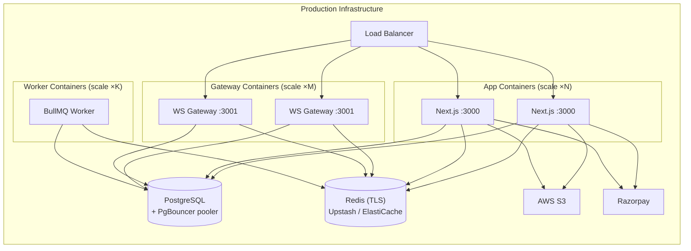

### Production Checklist

| Item | Detail |
|---|---|
| `NODE_ENV=production` | Required |
| `DATABASE_URL` | Via PgBouncer or Neon for connection pooling |
| `DIRECT_URL` | Primary DB URL for Prisma migrations |
| `REDIS_TLS=true` | Required for Upstash / ElastiCache |
| `RAZORPAY_WEBHOOK_SECRET` | Required for HMAC webhook verification |
| `ENABLE_MOCK_PAYMENT=false` | Must be explicitly disabled in production |
| `SESSION_SECRET` | 32+ random characters |
| Redis `maxmemory-policy noeviction` | **System invariant — mandatory** |
| Worker as separate container | `npm run worker` |
| Gateway as separate container | `npm run realtime` |
| Persistent volume for `uploads/` | If using local disk fallback for files |

### Environment Variables

| Variable | Required | Description |
|---|---|---|
| `DATABASE_URL` | ✅ | PostgreSQL (via pooler in prod) |
| `DIRECT_URL` | ✅ | Direct PostgreSQL (migrations) |
| `REDIS_URL` | ✅ | Redis connection string |
| `SESSION_SECRET` | ✅ | 32+ char random string |
| `RAZORPAY_KEY_ID` | ✅ | Razorpay public key |
| `RAZORPAY_KEY_SECRET` | ✅ | Razorpay secret key |
| `RAZORPAY_WEBHOOK_SECRET` | Prod | HMAC webhook verification |
| `ENABLE_MOCK_PAYMENT` | Dev | `true` to bypass Razorpay in dev |
| `AWS_ACCESS_KEY_ID` | S3 | Leave blank for local disk fallback |
| `AWS_SECRET_ACCESS_KEY` | S3 | Leave blank for local disk fallback |
| `S3_BUCKET_NAME` | S3 | Bucket name |
| `REDIS_TLS` | Cloud | `true` for Upstash / ElastiCache |
| `LOG_LEVEL` | Optional | `info` / `debug` / `error` |
| `REALTIME_PORT` | Optional | Gateway port (default: 3001) |

---

## 📄 License

MIT License © 2026 — Built for enterprise telemedicine infrastructure.

---

<div align="center">

**Built with precision. Designed for compliance. Proven under chaos. Ready for production.**

</div>
